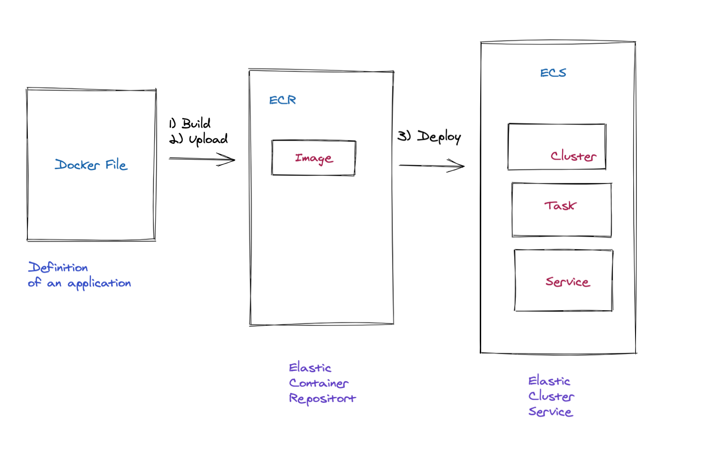

# How to deploy a Docker App to AWS using ECS

## What we will build

In this tutorial we will explain how to:

- Package and build a node application and package a simple node application with Docker
- Create a ECR repository to store our Docker Image
- Upload the Docker image to the repository
- Create and launch an Elastic Container Cluster (ECR)
- Launch our application as a task within the Elastic Container Cluster
- Expose and open this application on internet



- [Docker](https://www.docker.com) is a technology that helps to package and ship applications easily in production.
- [ECS](https://aws.amazon.com/ecs/?whats-new-cards.sort-by=item.additionalFields.postDateTime&whats-new-cards.sort-order=desc&ecs-blogs.sort-by=item.additionalFields.createdDate&ecs-blogs.sort-order=desc) stands for Elastic Container Service. It is a fully managed container orchestration service
- [ECR](https://docs.aws.amazon.com/AmazonECR/latest/userguide/what-is-ecr.html) stands for Elastic Container Repository. ECR allows to storage of Docker Images on AWS.

Concepts:

- A cluster is logical grouping of hardware ressources.
- A task a set of metadata (memory, cpu, port mappings, environment variables, etc) that describes how a container should be deployed.
- Services are responsible to manage advance configuration such as load balancing

## The [nodeJS](https://nodejs.org) application to deploy

We want to deploy a basic express node application that displays the current time each time the index page is refreshed.

### `package.json`

```json
{
  "name": "docker_web_app",
  "version": "1.0.0",
  "description": "Node.js on Docker",
  "author": "Raphaël MANSUY raphael.mansuy+contact@gmail.com>",
  "main": "server.js",
  "scripts": {
    "start": "node server.js"
  },
  "dependencies": {
    "express": "^4.17.1"
  }
}
```

### `server.js`

```javascript
"use strict"

const express = require("express")

// Constants
const PORT = 8080
const HOST = "0.0.0.0"

// App
const app = express()
app.get("/", (req, res) => {
  res.send(`Hello World - ${new Date().toISOString()}`)
})

app.listen(PORT, HOST)
console.log(`Running on http://${HOST}:${PORT}`)
```

[https://nodejs.org/en/docs/guides/nodejs-docker-webapp/](https://nodejs.org/en/docs/guides/nodejs-docker-webapp/)

## Package the nodejs application with a Docker file

In the same directory of this application we can create a `Dockerfile` that explains how to build a container with this application:

### `Dockerfile`

```dockerfile
FROM node:14
# Create app directory
WORKDIR /usr/src/app
# Install app dependencies
# A wildcard is used to ensure both package.json AND package-lock.json are copied
# where available (npm@5+)
COPY package*.json ./

RUN npm install
# If you are building your code for production
# RUN npm ci --only=production

# Bundle app source
COPY . .

EXPOSE 8080

CMD [ "node", "server.js" ]

```

**This file defines the following steps:**

- start from the node:14 image
- create a directory `/usr/src/ap` inside the container
- copy the local file with pattern `package*.json` in the container
- run `npm install`
- copy all the local files to the container
- expose the port `8080` inside the container
- run `node` with the file `server.js` when the container starts

## Building the image

Run the following command to build an image with the tag `node-web-app`

```bash
docker build -t node-web-app .
```

## Running the image

Run the following command to start the application in detached mode:

```bash
docker run -p 80:8080 -d node-web-app
```

The container is now running and the 8080 port within the container is exposed as the 80 port on your local machine.

We can now test the application with the [CURL command](https://curl.se/)

```bash
curl http://localhost:80
```

Results:

```bash
Hello World - 2021-02-11T05:06:12.739Z
```

We are now ready to deploy this container to the cloud.

## Connect to AmazonECR

**Prerequisites**

- [`aws cli`](https://aws.amazon.com/cli/) must be installed
- your [aws profile](https://docs.aws.amazon.com/cli/latest/userguide/cli-configure-profiles.html) must be configured and have ECS admin rights enabled

Run the following command:

```bash
aws ecr get-login-password --region us-west-2 | docker login
```

If your have access you should have this display on the terminal:

```bash
Authenticating with existing credentials...
Login Succeeded

```

## Create your AmazonECR in the AWS Console

Connect to the AWS Console and to the ECS Administration screen to create a new repository.


Click on **Create Repository** and choose `testrepository` as a name for your repository:


The ECR repository is now created:


## Upload the image on AWS ECR

Click now on the `push commands button` on the repository screen:


Copy and execute each command on your machine:


**connect**:

```bash
aws ecr get-login-password --region us-west-2 | docker login --username AWS --password-stdin 3680199100XXX.dkr.ecr.us-west-2.amazonaws.com
```

**build**:

```bash
docker build -t testrepository .

```

**build**:

```bash
docker tag testrepository:latest 3680199100XXX.dkr.ecr.us-west-2.amazonaws.com/testrepository:latest
```

**push to ECR**:

```bash
docker push 3680199100XXX.dkr.ecr.us-west-2.amazonaws.com/testrepository:latest
```

The image is now published and available on ECR ready to be deployed:


## Create an ECS Cluster

Go to the ECS home page and click on the `create cluster`button:
