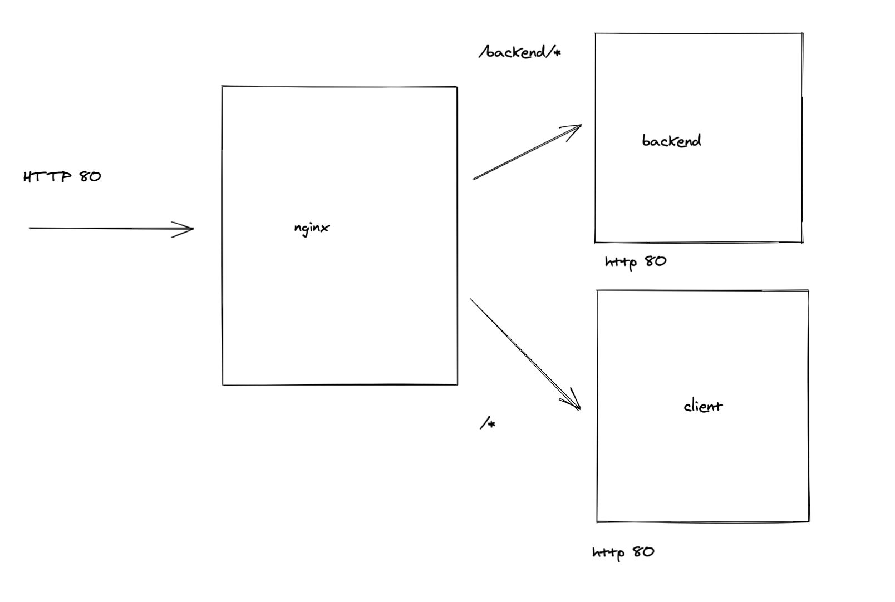

# Using NGINX as a proxy



`nginx.cong`

```

upstream client {
  server: client:80
}

upstream backend {
  server: backend:80
}

server {
 listen 80

 location /backend {
    rewrite /backend/(.*) /$1 break;
    proxy_pass http://backend
 }

 location / {
   proxy_pass http://client
 }


}

```


[Full example of configuration](https://www.nginx.com/resources/wiki/start/topics/examples/full/)
